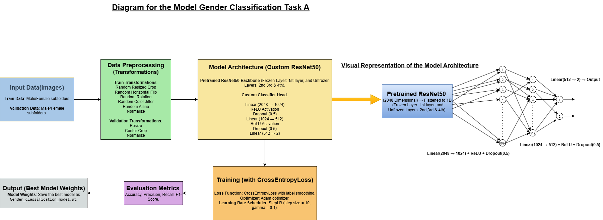
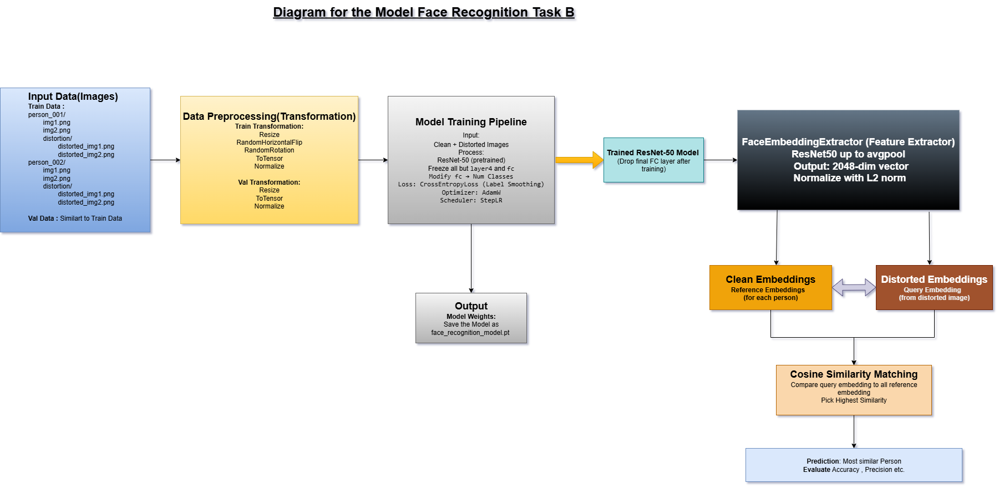

# 👤 Gender Classification Under Challenging Conditions – COMSYS-2025 Hackathon (Task A)  and 🚀 Task B: Face Recognition - COMSYS 2025 FACECOM Challenge

Here is a diagram representing the model Gender Classification Task A:

Here is a diagram representing the model Face Recognition System Task B:

🎯 COMSYS-2025 Hackathon Submission: Gender Classification & Face Recognition

This repository contains our final submission for Task A (Gender Classification) and Task B (Face Recognition) under degraded visual conditions using deep learning with PyTorch.

📦 Requirements & Setup Instructions

Install all dependencies:

pip install -r requirements.txt

requirements.txt
torch>=2.0.1
torchvision>=0.15.2
scikit-learn>=1.3.0
Pillow>=9.5.0
numpy>=1.24.4
argparse>=1.4.0

📁 Folder Structure & Expected Input Format

🧪 Test Folder Structure

🔹 For Task A: Gender Classification

test_task_A/
├── male/
│   ├── image1.jpg
│   └── ...
├── female/
    ├── image1.jpg
    └── ...
    
🔹 For Task B: Face Recognition

test_task_B/
├── person_1/
│   ├── clean1.jpg
│   ├── clean2.jpg
│   └── distortion/
│       ├── distorted1.jpg
│       └── ...
├── person_2/
│   ├── clean1.jpg
│   └── distortion/
│       ├── distorted1.jpg
│       └── ...
...

The structure is automatically detected

🚀 Running the Evaluation

Use the following unified command for both tasks:

python test.py --test_dir /path/to/test_data

Replace /path/to/test_data with the actual test folder path having the same structure

Examples:

For Task A:

python test.py --test_dir ./test_gender

For Task B:

python test.py --test_dir ./test_faces

📝 Notes for Reproducing Submitted Results

Ensure the test dataset follows the expected folder structure:

Task A (Gender Classification): male/, female/

Task B (Face Recognition): person-wise folders with distortion/ subfolders.

The test.py script automatically detects the task based on the folder contents and applies the appropriate evaluation pipeline.

Model weights must be placed in the same directory.

The evaluation works on both CPU and GPU seamlessly.

✅ Task A: Gender Classification

Model: ResNet-50 with custom classifier head

Training: Fine-tuned only layer2, layer3, and layer4

Data Augmentation: Applied during training (crop, flip, jitter)

Transform during test: Resize(256) → CenterCrop(224) 

📊 Evaluation on Training Set:(During the training of the model)
  - Accuracy : 0.9346
  - Precision: 0.9426
  - Recall   : 0.9821
  - F1-Score : 0.9620

Metric Evaluation on the train dataset: (During testing through the test.py)
  - Accuracy : 0.9605
  - Precision: 0.9868
  - Recall   : 0.9661
  - F1-Score : 0.9763

Metric Evaluation on the val dataset:

Accuracy: 0.9455

Precision: 0.9651

Recall: 0.9679

F1-Score: 0.9665

⚠️ Note on Slight Metric Differences for Task A (Training Set)

During training, evaluation on the training set used augmented data transformations (e.g., RandomResizedCrop, HorizontalFlip, ColorJitter, etc.) consistent with the training pipeline.

However, in the unified test.py script, a fixed transformation is applied:
transforms.Resize(256),
transforms.CenterCrop(224),

This fixed and cleaner transformation improves the quality of input images during evaluation, which results in slightly higher evaluation metrics (Accuracy, Precision, Recall, F1-score) when testing on the training set using test.py.

✅ Validation and test set metrics remain consistent, since the same fixed transforms were used during training and evaluation.

📌 To reproduce: Load Gender_Classification_model.pt and run on any dataset structured with male/ and female/ subfolders.

✅ Ensure that test.py and Gender_Classification_model.pt are located in the same directory, as given in the GitHub repository, or update the path in test.py accordingly.

✅ Task B: Face Recognition

Model: ResNet-50 backbone, output layer replaced with classifier for 877 classes

Embedding Extractor: Uses cosine similarity for distorted vs clean matching

Transform: Resize(224, 224) → ToTensor() → Normalization

📊 Evaluation Metrics on Training Set:
  - Accuracy : 1.0000
  - Precision: 1.0000
  - Recall   : 1.0000
  - F1-Score : 1.0000

Metric Evaluation on the val dataset:

Accuracy: 0.9990

Precision: 0.9989

Recall: 0.9991

F1-Score: 0.9989

📌 To reproduce: Load face_recognition_model.pt and run on dataset structured by person folders, each with clean images and a distortion/ subfolder.

✅ Ensure that test.py and face_recognition_model.pt are located in the same directory, as given in the GitHub repository, or update the path in test.py accordingly.

🧠 Authors & Team Roles

Team Member         	&     Role

SOUMABRATA BHOWMIK	     :    ML & Deep Learning (Model Design, Training, Optimization)

ANNYATOMA DAS	         :   Dataset Setup, Evaluation, Metric Analysis & Submission

SAHELI MONDAL	         :  Testing, Packaging, Analysis, Documentation

